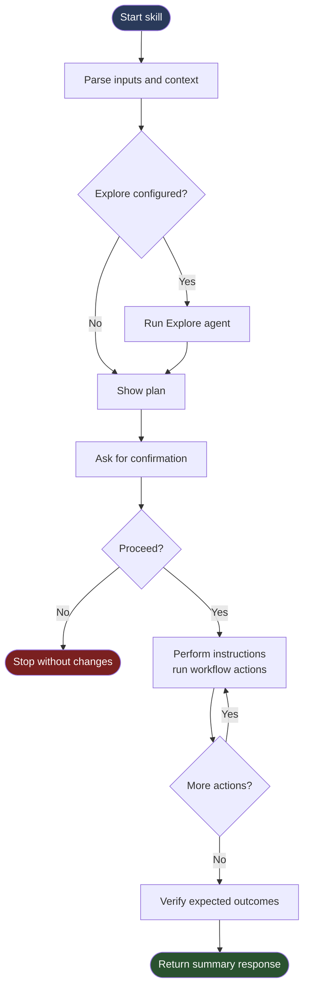

# Canopy — Framework Specification

See [README.md](README.md) for overview, quick start, and setup.

---

## Framework Skills

Canopy ships as three [agentskills.io](https://agentskills.io)-format Agent Skills, split along authoring-vs-execution lines:

| Skill | Role | Purpose |
|-------|------|---------|
| `canopy-runtime` | **Execution engine** | Interprets canopy-flavored skills at runtime. Contains platform detection, primitives spec (`framework-ops.md`), category semantics + op lookup + tree format (`skill-resources.md`), and per-platform runtime rules (`runtime-claude.md`, `runtime-copilot.md`). Hidden from `/` menu. Loaded ambiently via `CLAUDE.md` / `.github/copilot-instructions.md`. Install this alone to execute canopy skills without authoring. |
| `canopy` | **Authoring agent** | Creates, modifies, scaffolds, validates, improves, refactors, advises on, and converts Canopy skills. Depends on `canopy-runtime` for the framework spec (reads `../canopy-runtime/references/...` at dispatch). Provides `/canopy` (and `/canopy help` for the operations reference). |
| `canopy-debug` | **Trace wrapper** | Trace any canopy-flavored skill with phase banners and per-node tracing. Loads canopy-runtime at the top of its tree for formal runtime adherence. |

When modifying `FRAMEWORK.md`, `skills/canopy-runtime/references/skill-resources.md`, or `skills/canopy-runtime/references/framework-ops.md`, also update the relevant policy files in `skills/canopy/assets/policies/` to stay in sync.

### Skill Format

`canopy`'s `SKILL.md` is itself written in **Canopy skill format** (frontmatter + `## Agent` + `## Tree` + `## Rules` + `## Response:`). Its `## Tree` provides deterministic op dispatch via an explicit `SWITCH/CASE` block — no LLM-inferred routing.

Skills live at `.claude/skills/<name>/SKILL.md` (or `.github/skills/<name>/SKILL.md` on Copilot). Skill resource files follow these category conventions:

Skills follow the agentskills.io standard layout — only `SKILL.md` at the root, with `scripts/`, `references/`, and `assets/` as the three top-level subdirectories:

| Directory | Content |
|-----------|---------|
| `<skill>/scripts/` | Executable code (`.ps1`, `.sh`) invoked via named sections |
| `<skill>/references/ops.md` or `<skill>/references/ops/<name>.md` | Skill-local op definitions |
| `<skill>/references/<other>.md` | Supporting documentation loaded on demand (per the agentskills.io progressive-disclosure pattern) |
| `<skill>/assets/templates/` | Fillable output documents with `<token>` placeholders |
| `<skill>/assets/constants/` | Read-only lookup data |
| `<skill>/assets/schemas/` | JSON schemas used as output contracts |
| `<skill>/assets/checklists/` | Evaluation criteria lists |
| `<skill>/assets/policies/` | Behavioural constraints |
| `<skill>/assets/verify/` | Expected-state checklists for `VERIFY_EXPECTED` |

Older skills using a flat layout (category dirs at the skill root: `schemas/`, `templates/`, `commands/`, `constants/`, `checklists/`, `policies/`, `verify/`, `ops.md`, `ops/`) continue to execute correctly — canopy-runtime resolves `Read` references literally. `/canopy improve` can migrate them to the standard layout on user opt-in.

`gh skill install` places the entire skill directory under the agent's skills root — no symlinks, no setup scripts.

---

## Runtime Model

Canopy uses an **interpreter** model for cross-platform support. `SKILL.md` is always the single source of truth — no generated artifacts.

At execution time the canopy skill:
1. Detects the active platform (Claude Code or GitHub Copilot)
2. Loads the matching runtime spec from `references/`
3. Executes the skill tree using platform-appropriate primitives

| File | Platform |
|------|----------|
| `skills/canopy-runtime/references/runtime-claude.md` | Claude Code — native subagents, `.claude/` paths |
| `skills/canopy-runtime/references/runtime-copilot.md` | GitHub Copilot — inline subagent fallback, `.github/` paths |

Platform-agnostic constructs (`ASK`, `IF/ELSE_IF`, `SWITCH/CASE`, `SHOW_PLAN`, `VERIFY_EXPECTED`) behave identically on both platforms. The runtime spec only defines what differs.

---

## Directory Layout

### Source repository (`claude-canopy/`)

```
claude-canopy/
├── skills/
│   ├── canopy/                          # Authoring agent
│   │   ├── SKILL.md                     # Loads canopy-runtime spec up-front, dispatches to ops
│   │   ├── references/
│   │   │   └── ops/                     # Per-operation procedure files (11 + fetch-dispatch-context)
│   │   └── assets/
│   │       ├── policies/                # Authoring rules, decision flowchart, etc. (5)
│   │       ├── constants/               # Lookup tables used by authoring ops
│   │       ├── schemas/                 # Subagent output contracts (dispatch-schema, explore-schema)
│   │       ├── templates/               # SKILL.md + ops.md skeletons used by SCAFFOLD
│   │       └── verify/                  # Expected-state checklists per authoring op
│   ├── canopy-debug/                    # Trace wrapper
│   │   ├── SKILL.md
│   │   ├── references/ops.md
│   │   └── assets/policies/debug-output.md
│   └── canopy-runtime/                  # Execution engine
│       ├── SKILL.md                     # Overview + platform detection + Activation + pointers to references/
│       └── references/
│           ├── framework-ops.md         # Framework primitives (IF, SWITCH, FOR_EACH, …)
│           ├── runtime-claude.md        # Claude Code runtime rules
│           ├── runtime-copilot.md       # GitHub Copilot runtime rules
│           └── skill-resources.md       # Category behavior, op lookup chain, tree format, subagent contract, safety preamble
├── docs/                                 # FRAMEWORK.md, AUTHORING.md, CHEATSHEET.md, etc.
├── assets/                               # Logo / icon files
├── .canopy-version                       # Single-line version (machine-readable)
└── LICENSE
```

### After install in a consumer repo

`gh skill install` drops each chosen skill under the agent's skills root:

```
<consumer>/
├── .claude/skills/                       # if installed with --agent claude-code
│   ├── canopy/                           # authoring agent (optional — required only if author skills)
│   ├── canopy-debug/                     # trace wrapper
│   ├── canopy-runtime/                   # execution engine (minimum install — required to execute any canopy skill)
│   └── <your-skill>/                     # consumer-authored skills
└── .github/skills/                       # if installed with --agent github-copilot
    ├── canopy/
    ├── canopy-debug/
    └── canopy-runtime/
```

A consumer-authored skill follows the same agentskills.io layout:

```
<consumer>/.claude/skills/<your-skill>/
├── SKILL.md                              # Skill definition — frontmatter (with `compatibility`) + safety preamble + Tree + Rules + Response
├── scripts/                              # PowerShell / shell scripts with named sections
├── references/
│   └── ops.md                            # Skill-local op definitions (or `ops/<name>.md` for complex skills)
└── assets/
    ├── templates/                        # Fillable output documents with <token> placeholders
    ├── constants/                        # Read-only lookup data
    ├── schemas/                          # Subagent output contracts, input/config file shapes
    ├── checklists/                       # Evaluation criteria lists iterated by ops
    ├── policies/                         # Behavioural constraints
    └── verify/                           # Expected-state checklists for VERIFY_EXPECTED
```

---

## Notation

| Symbol | Meaning |
|--------|---------|
| `<<` | Input — source file, condition to evaluate, or user-facing options |
| `>>` | Output — fields captured into step context, or fields displayed to user |
| `\|` | Separator — between multiple inputs, options, or output fields |

Examples:
```
VAULT_KV_READ secret/app/creds >> {client_id, client_secret}
ASK << Proceed? | Yes | No
FETCH_GITHUB_RELEASES << org/repo >> breaking-changes
SHOW_PLAN >> files | Vault changes | API calls
```

---

## Skill Anatomy

See [README.md](README.md) for the full skill anatomy reference. For the `## Agent` section's three canonical shapes (minimal / sub-task bullets / op reference) and content rules, see [AUTHORING.md — `## Agent`](AUTHORING.md#-agent).

---

## Workflow Diagram

High-level execution flow of a Canopy skill:



Source file: [docs/diagrams/workflow.mmd](diagrams/workflow.mmd).

If your Mermaid tool reports "No diagram type detected", open [docs/diagrams/workflow.mmd](diagrams/workflow.mmd) directly or pass only the Mermaid code block content (without surrounding Markdown text).

---

## Tree Execution Model

The tree is a **sequential pipeline** with branching. Execution is:
1. Start at the root node
2. Execute each sibling top-to-bottom
3. For `IF`/`ELSE_IF`/`ELSE` chains: evaluate conditions in order; execute first matching branch; skip the rest
4. After a branch completes, resume on the next sibling after the chain
5. `EXPLORE` is always the first node if an `## Agent` section is present

**Node types:**

| Node | Form | Behaviour |
|------|------|-----------|
| Op call | `OP_NAME << inputs >> outputs` | Look up and execute op definition |
| Natural language | any prose | Execute as described |
| `IF` | `IF << condition` | Branch — execute children if true |
| `ELSE_IF` | `ELSE_IF << condition` | Continue chain — execute if prior false |
| `ELSE` | `ELSE` | Close chain — execute if all prior false |
| `FOR_EACH` | `FOR_EACH << item in collection` | Iterate — execute body once per element |

**Tree syntax — two equivalent formats:**

*Markdown list syntax* — `*` nested lists written directly under `## Tree` (no fenced code block):

```markdown
* skill-name
  * OP_ONE << input
  * IF << condition
    * OP_TWO
  * ELSE
    * natural language step
  * OP_THREE >> output
```

*Box-drawing syntax* — fenced code block with tree characters:

```
skill-name
├── OP_ONE << input
├── IF << condition
│   └── OP_TWO
├── ELSE
│   └── natural language step
└── OP_THREE >> output
```

Both are parsed identically. Use whichever reads more naturally for the skill.

---

## Control Flow Primitives

Defined in `skills/canopy-runtime/references/framework-ops.md` (bundled with the `canopy-runtime` skill). Always looked up there — never overridden in skill-local or project ops.

### `IF << condition`
```
IF << condition
├── then-branch (op or natural language)
[ELSE_IF << condition2
 ├── branch2]
[ELSE
 └── else-branch]
```

### `ELSE_IF << condition`
Continues an `IF` or `ELSE_IF` chain. Only evaluated if all prior conditions were false.

### `ELSE`
Closes an `IF` or `ELSE_IF` chain. Executed only if all prior conditions were false.

### `FOR_EACH << item in collection`
```
FOR_EACH << item in collection
├── body-step-1
├── body-step-2
[└── IF << exit condition
    └── BREAK]
```
Binds `item` to each element of `collection` and executes the body once per element.
Empty collection skips the body entirely. `BREAK` inside the body exits the loop early.

### `SWITCH << expression`
```
SWITCH << expression
├── CASE << value1
│   └── branch1
[├── CASE << value2
│   └── branch2]
[└── DEFAULT
    └── default-branch]
```
Evaluates `expression` once; executes the first `CASE` whose value matches; skips the rest.
`DEFAULT` executes only if no `CASE` matched.
Use when branching on a single expression against multiple discrete values.

### `CASE << value`
A branch within a `SWITCH` block. Executed when the `SWITCH` expression equals `value`.

### `DEFAULT`
Closes a `SWITCH` block. Executed only if no `CASE` matched.

### `ASK << question | option1 | option2 [| ...]`
Present a question with options. Execution halts until the user responds.

### `SHOW_PLAN >> field1 | field2 | ...`
Present a structured pre-execution plan covering the listed fields.

### `VERIFY_EXPECTED << assets/verify/verify-expected.md`
Check current state against expected outcomes in the verify file.

---

## Op Lookup Order

When a tree node contains an `ALL_CAPS` identifier:

1. **`<skill>/references/ops.md`** or **`<skill>/references/ops/<name>.md`** — skill-local ops (checked first). Backward-compatible fallback: `<skill>/ops.md` at root for legacy-layout skills.
2. **Consumer-defined cross-skill ops** — optional; consumers package these as their own skill (no built-in location)
3. **`canopy-runtime/references/framework-ops.md`** — framework primitives (fallback, bundled with the `canopy-runtime` skill)

Primitives (`IF`, `ELSE_IF`, `ELSE`, `SWITCH`, `CASE`, `DEFAULT`, `FOR_EACH`, `ASK`, `SHOW_PLAN`, `VERIFY_EXPECTED`, `BREAK`, `END`) always
resolve to `canopy-runtime/references/framework-ops.md` and are never overridden.

---

## Skill-Local `references/ops.md`

Skill-specific branches, multi-step procedures, and decision trees. Lives alongside
`SKILL.md`, not in a subdirectory.

**Simple op** — prose for linear behavior:
```markdown
## FETCH_CHART_DEFAULTS

Fetch the chart's upstream default values from the internet to confirm the current image and tag.
```

**Branching op** — use tree notation (either syntax):

Box-drawing format:
```markdown
## EDIT_IMAGE_TAG << image_defined_in | target_tag

\`\`\`
EDIT_IMAGE_TAG << image_defined_in | target_tag
├── IF << image_defined_in = chart-defaults-only
│   └── CREATE_ENV_OVERRIDE
└── ELSE — edit tag in-place at the path from image_defined_in
\`\`\`
```

Markdown list format:
```markdown
## EDIT_IMAGE_TAG << image_defined_in | target_tag

* EDIT_IMAGE_TAG << image_defined_in | target_tag
  * IF << image_defined_in = chart-defaults-only
    * CREATE_ENV_OVERRIDE
  * ELSE — edit tag in-place at the path from image_defined_in
```

Op definitions calling other ops (including shared ops) is valid — the system is self-similar.

---

## Op Registries

### Framework primitives (`skills/canopy-runtime/references/framework-ops.md`)

Control-flow and interaction ops available in every skill, in every project. Bundled with the `canopy` skill.

| Op | Signature | Purpose |
|----|-----------|---------|
| `IF` | `<< condition` | Branch on condition |
| `ELSE_IF` | `<< condition` | Continue IF chain |
| `ELSE` | — | Close IF chain |
| `SWITCH` | `<< expression` | Match expression against CASE values |
| `CASE` | `<< value` | Branch within SWITCH; execute if expression equals value |
| `DEFAULT` | — | Close SWITCH block; execute if no CASE matched |
| `FOR_EACH` | `<< item in collection` | Iterate body over every element in collection |
| `BREAK` | — | Exit current loop or op, resume caller |
| `END` | `[message]` | Halt skill execution |
| `ASK` | `<question> << option1 \| ...` | Prompt user; halt until response |
| `SHOW_PLAN` | `>> field1 \| ...` | Present pre-execution plan |
| `VERIFY_EXPECTED` | `<< assets/verify/verify-expected.md` | Check state against expected outcomes (or `verify/verify-expected.md` for legacy-layout skills) |

### Project-wide ops (consumer-defined)

Project-specific ops shared across skills in this project. There is no built-in location in the agentskills.io distribution — consumers who need shared cross-skill ops author their own skill (e.g. a `project-ops` skill) and reference it explicitly. Op definitions follow the same tree notation as skills; lookup order places them after skill-local ops but before framework primitives.

---

## Category Resource Subdirectories

When a tree node or op step says `Read <category>/<file>`, the directory determines behavior:

| Directory | File types | Behavior |
|-----------|------------|----------|
| `assets/schemas/` (was `schemas/`) | `.json`, `.md` | Structure definitions for data the skill reads or writes: subagent output contracts, input/config file shapes, report template skeletons |
| `assets/templates/` (was `templates/`) | `.yaml`, `.md`, `.yaml.gotmpl` | Fillable output documents with `<token>` placeholders substituted from context and written to a target path |
| `scripts/` (was `commands/`) | `.ps1`, `.sh` | Executable scripts invoked by name via a named section (`# === Section Name ===`); output captured into context |
| `assets/constants/` (was `constants/`) | `.md` | Read-only lookup data referenced by ops: mapping tables, enum-like value lists, fixed configuration values, default branch/path names |
| `assets/checklists/` (was `checklists/`) | `.md` | Evaluation criteria lists (`- [ ] ...`) that ops iterate over to assess compliance or correctness |
| `assets/policies/` (was `policies/`) | `.md` | Behavioural constraints governing skill execution: what the skill must/must not do, consent requirements, output rendering protocols |
| `assets/verify/` (was `verify/`) | `.md` | Expected-state checklists consumed exclusively by `VERIFY_EXPECTED` |

**Reference line pattern:** `Read \`<category>/<file>\` for <brief description>.`
Load at point of use in the tree — never front-load all reads at the top.

---

## Skill Resource Conventions

`skills/canopy-runtime/references/skill-resources.md` documents the category behavior table, op lookup order, tree execution model, and explore subagent contract. It is no longer an ambient rule (the agentskills.io distribution has no glob mechanism); it is loaded on demand by `canopy` ops when needed.

Consumers do not need to wire anything — once `canopy` is installed, its ops resolve resource references through the bundled reference docs.

---

## Debug Mode

The `debug` meta-skill wraps any other skill with live phase banners and per-node tree
tracing. Invoke as:

```
/canopy-debug <skill-name> [arguments]
```

Example:

```
/canopy-debug bump-version 2.1.0
```

Debug mode emits to the stream as the skill runs:

- A **phase banner** at the start of each execution phase (Initialize, Explore, Tree
  Execution, Verify, Response) — only phases active for the given skill are shown
- A **tree-state block** before and after each node, showing all nodes with status
  symbols: `→` executing, `✓` done, `⊘` skipped, `⏸` waiting, `⟳` subagent, `✗` failed,
  `⊙` pending
- **Input/output values** for nodes with formal `<<` / `>>` declarations

No changes to existing skills are required. The feature is entirely contained in
`skills/canopy-debug/` and activated only when the user calls `/canopy-debug`.

The setup scripts auto-discover `skills/canopy-debug/` and create the appropriate
symlink or junction — no manual wiring needed after running setup.

See `skills/canopy-debug/assets/policies/debug-output.md` for the full visual protocol.
