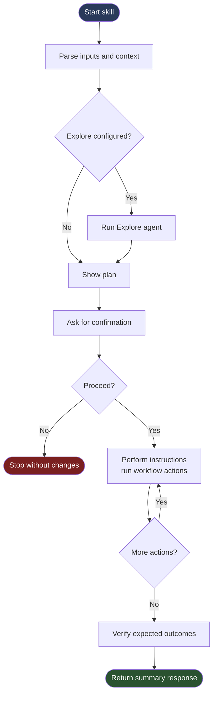

# Framework Specification

The formal spec for canopy-flavored skills. For control-flow primitives (`IF`, `SWITCH`, `FOR_EACH`, etc.) see [Primitives](PRIMITIVES.md); for per-platform execution rules see [Runtimes](RUNTIMES.md). For narrative explanations see [Concepts](../concepts/).

---

## Framework Skills

Canopy ships as three [agentskills.io](https://agentskills.io)-format Agent Skills, split along authoring-vs-execution lines:

| Skill | Role | Purpose |
|-------|------|---------|
| `canopy-runtime` | **Execution engine** | Interprets canopy-flavored skills at runtime. Contains platform detection, primitives spec (sliced — `references/ops.md` index + `references/ops/<slice>.md` per-feature files), category semantics + op lookup + tree format (`skill-resources.md`), and per-platform runtime rules (`runtime-claude.md`, `runtime-copilot.md`). Hidden from `/` menu. Loaded ambiently via `CLAUDE.md` / `.github/copilot-instructions.md`. Install this alone to execute canopy skills without authoring. The runtime reads each skill's `metadata.canopy-features` manifest to load only the slices it needs. |
| `canopy` | **Authoring agent** | Creates, modifies, scaffolds, validates, improves, refactors, advises on, and converts Canopy skills. Depends on `canopy-runtime` for the framework spec (reads `../canopy-runtime/references/...` at dispatch). Provides `/canopy` (and `/canopy help` for the operations reference). |
| `canopy-debug` | **Trace wrapper** | Trace any canopy-flavored skill with phase banners and per-node tracing. Loads canopy-runtime at the top of its tree for formal runtime adherence. |

Skills live under a **skills root**, resolved at runtime by canopy-runtime in this order:

1. `.agents/skills/<name>/SKILL.md` — cross-client (gh skill 2.91+ default; both Claude Code and Copilot read it)
2. `.claude/skills/<name>/SKILL.md` — Claude Code
3. `.github/skills/<name>/SKILL.md` — GitHub Copilot

The first matching directory containing `canopy-runtime/SKILL.md` is the skills root for the project. canopy-runtime self-identifies the active host (Claude Code / Copilot) at runtime — it does NOT infer the platform from the skills-root path. `runtime-claude.md` and `runtime-copilot.md` use the abstract placeholder `<skills-root>` so both specs work regardless of install location.

Skills follow the agentskills.io standard layout — only `SKILL.md` at the root, with `scripts/`, `references/`, and `assets/` as the three top-level subdirectories:

| Directory | Content |
|-----------|---------|
| `<skill>/scripts/` | Executable code (`.ps1`, `.sh`) invoked via named sections |
| `<skill>/references/ops.md` or `<skill>/references/ops/<name>.md` | Skill-local op definitions |
| `<skill>/references/<other>.md` | Supporting documentation loaded on demand (per the agentskills.io progressive-disclosure pattern) |
| `<skill>/assets/templates/` | Fillable output documents with `<token>` placeholders |
| `<skill>/assets/constants/` | Read-only lookup data |
| `<skill>/assets/schemas/` | JSON schemas used as output contracts |
| `<skill>/assets/checklists/` | Evaluation criteria lists |
| `<skill>/assets/policies/` | Behavioural constraints |
| `<skill>/assets/verify/` | Expected-state checklists for `VERIFY_EXPECTED` |

Older skills using a flat layout (category dirs at the skill root: `schemas/`, `templates/`, `commands/`, `constants/`, `checklists/`, `policies/`, `verify/`, `ops.md`, `ops/`) continue to execute correctly — canopy-runtime resolves `Read` references literally. `/canopy improve` can migrate them to the standard layout on user opt-in.

`gh skill install` places the entire skill directory under the agent's skills root — no symlinks, no setup scripts. To publish a skill that consumers can install via `gh skill install`, place it at `skills/<name>/` in the publishing repo (top-level `skills/`, not `.claude/skills/`) — `gh skill install` rejects sources from hidden directories without `--allow-hidden-dirs`.

---

## Runtime Model

Canopy uses an **interpreter** model for cross-platform support. `SKILL.md` is always the single source of truth — no generated artifacts.

At execution time the canopy skill:
1. Detects the active platform (Claude Code or GitHub Copilot)
2. Loads the matching runtime spec from `references/`
3. Executes the skill tree using platform-appropriate primitives

Platform-agnostic constructs (`ASK`, `IF/ELSE_IF`, `SWITCH/CASE`, `SHOW_PLAN`, `VERIFY_EXPECTED`) behave identically on both platforms. The runtime spec only defines what differs. Full per-platform rules: [Runtimes](RUNTIMES.md).

---

## Directory Layout

### Source repository (`claude-canopy/`)

```
claude-canopy/
├── skills/
│   ├── canopy/                          # Authoring agent
│   │   ├── SKILL.md                     # Loads canopy-runtime spec up-front, dispatches to ops
│   │   ├── references/
│   │   │   └── ops/                     # Per-operation procedure files (11 + fetch-dispatch-context)
│   │   └── assets/
│   │       ├── policies/                # Authoring rules, decision flowchart, etc. (5)
│   │       ├── constants/               # Lookup tables used by authoring ops
│   │       ├── schemas/                 # Subagent output contracts (dispatch-schema, explore-schema)
│   │       ├── templates/               # SKILL.md + ops.md skeletons used by SCAFFOLD
│   │       └── verify/                  # Expected-state checklists per authoring op
│   ├── canopy-debug/                    # Trace wrapper
│   │   ├── SKILL.md
│   │   ├── references/ops.md
│   │   └── assets/policies/debug-output.md
│   └── canopy-runtime/                  # Execution engine
│       ├── SKILL.md                     # Overview + platform detection + Activation + pointers to references/
│       ├── references/
│       │   ├── ops.md                   # Primitive-slice index
│       │   ├── ops/                     # Per-feature primitive slices
│       │   │   ├── core.md              #   IF, ELSE_IF, ELSE, END, BREAK (always loaded)
│       │   │   ├── interaction.md       #   ASK, SHOW_PLAN
│       │   │   ├── control-flow.md      #   SWITCH, CASE, DEFAULT, FOR_EACH
│       │   │   ├── parallel.md          #   PARALLEL
│       │   │   ├── subagent.md          #   subagent dispatch markers + bold call-sites
│       │   │   ├── explore.md           #   EXPLORE + ## Agent soft-compat
│       │   │   └── verify.md            #   VERIFY_EXPECTED
│       │   ├── runtime-claude.md        # Claude Code runtime rules (uses <skills-root> placeholder)
│       │   ├── runtime-copilot.md       # GitHub Copilot runtime rules (uses <skills-root> placeholder)
│       │   └── skill-resources.md       # Layout, category behavior, op lookup, tree format, manifest, safety preamble
│       └── assets/
│           └── constants/
│               └── marker-block.md      # Canonical marker-block content (self-contained — runtime owns its own activation source)
├── docs/                                 # CONCEPTS.md, CHEATSHEET.md, GETTING_STARTED.md, reference/
├── assets/                               # Logo / icon files
├── .canopy-version                       # Single-line version (machine-readable)
└── LICENSE
```

### After install in a consumer repo

`gh skill install` drops each chosen skill under the agent's skills root. Three roots are recognised, in resolution order:

```
<consumer>/
├── .agents/skills/                       # cross-client (gh skill 2.91+ default; both Claude Code and Copilot read it)
│   ├── canopy/
│   ├── canopy-debug/
│   ├── canopy-runtime/
│   └── <your-skill>/
├── .claude/skills/                       # Claude Code only — `gh skill install ... --agent claude-code`
│   ├── canopy/                           # authoring agent (optional — required only if author skills)
│   ├── canopy-debug/                     # trace wrapper
│   ├── canopy-runtime/                   # execution engine (minimum install — required to execute any canopy skill)
│   └── <your-skill>/                     # consumer-authored skills
└── .github/skills/                       # GitHub Copilot only — `gh skill install ... --agent github-copilot`
    ├── canopy/
    ├── canopy-debug/
    └── canopy-runtime/
```

canopy-runtime resolves `<skills-root>` to whichever of these three contains `canopy-runtime/SKILL.md`. The cross-client root is preferred when present and avoids duplicating the install across `.claude/` and `.github/`.

A consumer-authored skill follows the same agentskills.io layout:

```
<consumer>/.claude/skills/<your-skill>/
├── SKILL.md                              # Skill definition — frontmatter (with `compatibility`) + safety preamble + Tree + Rules + Response
├── scripts/                              # PowerShell / shell scripts with named sections
├── references/
│   └── ops.md                            # Skill-local op definitions (or `ops/<name>.md` for complex skills)
└── assets/
    ├── templates/                        # Fillable output documents with <token> placeholders
    ├── constants/                        # Read-only lookup data
    ├── schemas/                          # Subagent output contracts, input/config file shapes
    ├── checklists/                       # Evaluation criteria lists iterated by ops
    ├── policies/                         # Behavioural constraints
    └── verify/                           # Expected-state checklists for VERIFY_EXPECTED
```

---

## Notation

| Symbol | Meaning |
|--------|---------|
| `<<` | Input — source file, condition to evaluate, or user-facing options |
| `>>` | Output — fields captured into step context, or fields displayed to user |
| `\|` | Separator — between multiple inputs, options, or output fields |

Examples:
```
VAULT_KV_READ secret/app/creds >> {client_id, client_secret}
ASK << Proceed? | Yes | No
FETCH_GITHUB_RELEASES << org/repo >> breaking-changes
SHOW_PLAN >> files | Vault changes | API calls
```

---

## Op Contracts (universal input/output schemas)

Any op definition — inline or subagent — may declare **input** and **output** contracts via blockquote markers under its heading. Contracts are JSON Schema files under `<skill>/assets/schemas/`.

| Op kind | Marker form | Effect |
|---|---|---|
| Inline op | `> **Input contract:** \`<path>\``  +/-  `> **Output contract:** \`<path>\`` (bare blockquote) | Declares contracts; runs inline in parent context |
| Subagent op | `> **Subagent.** Output contract: \`<path>\`. Input contract: \`<path>\`` | Declares contracts AND dispatches out-of-context (S2 marker) |
| Schema-less op | (no marker) | Runs inline; no contracts; back-compat default |

**Composition through bindings.** When `producer >> ctx.foo` is followed downstream by `consumer << ctx.foo`, the binding is a typed dataflow edge: producer's output schema describes what `ctx.foo` is; consumer's input schema describes what the consumer expects. vscode walks the binding graph and surfaces drift as diagnostics.

**Strict-contract mode.** Opt in via `metadata.canopy-contracts: strict`. Under strict mode, the runtime validates each contract-bearing op's input before firing and output before binding into context; halts with `[contract-violation]` on drift. Default (omitted): contracts are descriptive only; no runtime enforcement.

**Migration.** `/canopy improve` includes a contract-scaffolding pass that generates `assets/schemas/<op>-{input,output}.json` from each op's `<<` / `>>` declarations and bound variable names. Permissive defaults (`additionalProperties: true`) — author refines.

Full contract specification lives in `skills/canopy-runtime/references/skill-resources.md` → "Op contracts".

---

## Compatibility Field

Per the [agentskills.io spec](https://agentskills.io/specification), `compatibility` is a **free-text string, max 500 chars** — a declarative environment-requirements blurb. Every canopy-flavored skill (anything with `## Tree`) MUST declare it.

**Canonical form:**

```yaml
compatibility: Requires the canopy-runtime skill (published at github.com/kostiantyn-matsebora/claude-canopy). Install with any agentskills.io-compatible tool — e.g. `gh skill install`, `git clone`, the repo's `install.sh`/`install.ps1`, or the Claude Code plugin marketplace. Supports Claude Code and GitHub Copilot.
```

**Rules:**

- **Free-text only.** Structured shapes (`compatibility: { requires: [...] }`, `compatibility:\n  requires:\n    - foo`) are non-spec and rejected by `/canopy validate`. `/canopy improve` migrates them to the canonical form.
- **Max 500 characters.** Truncate aggressively; the field is a hint, not a manifest.
- **No `: ` (colon-space) inside an unquoted scalar** — YAML parses the colon as a mapping separator and `gh skill install` rejects the SKILL.md with a parse error. Use commas, em-dashes, or semicolons; or quote the whole value.
- **Declarative, not prescriptive.** Name the dependency and the source repo so the agent can resolve it from the field alone. List install tools as alternatives — never as a single mandated method — so the agent picks based on what its environment supports.
- **Authoring ops emit it automatically.** `/canopy create`, `/canopy scaffold`, `/canopy convert-to-canopy`, and `/canopy modify` insert the canonical form. `/canopy convert-to-regular` strips it (regular agentskills.io skills don't need it).

---

## Activation

canopy-runtime self-activates the first time an agent loads its `SKILL.md`. The `## Activation` section in `skills/canopy-runtime/SKILL.md` writes the marker block (sourced from `skills/canopy-runtime/assets/constants/marker-block.md`) into the platform's ambient instructions file:

| Platform | Target file |
|----------|-------------|
| Claude Code | `CLAUDE.md` |
| GitHub Copilot | `.github/copilot-instructions.md` |

**Who writes the marker block, by install path:**

- `install.sh` / `install.ps1` — the script writes it during install. Shell-context, no agent to defer to → project is fully activated when install completes.
- `gh skill install` — file placement only. The marker block is written by the next agent invocation that loads `canopy-runtime/SKILL.md` and runs Activation.
- Claude Code plugin marketplace — same as `gh skill install`: file placement only; the agent writes the block on first load.

**Idempotent.** Activation on a fully activated project is a no-op. The write contract: CREATE if absent, APPEND if no markers, REPLACE if exactly one marker pair, WARN on multiple, REFUSE on mismatched delimiters.

**Self-contained.** canopy-runtime owns its own marker-block source (`assets/constants/marker-block.md`) so a `gh skill install canopy-runtime` (without `canopy`) still has everything needed for activation.

The legacy `/canopy:canopy activate` op is still available for forcing a re-write after a release that changed the marker block content.

---

## Workflow Diagram

High-level execution flow of a Canopy skill:



Source file: [diagrams/workflow.mmd](../diagrams/workflow.mmd).

If your Mermaid tool reports "No diagram type detected", open [diagrams/workflow.mmd](../diagrams/workflow.mmd) directly or pass only the Mermaid code block content (without surrounding Markdown text).

---

## Tree Execution Model

The tree is a **sequential pipeline** with branching. Execution is:
1. Start at the root node
2. Execute each sibling top-to-bottom
3. For `IF`/`ELSE_IF`/`ELSE` chains: evaluate conditions in order; execute first matching branch; skip the rest
4. After a branch completes, resume on the next sibling after the chain
5. `EXPLORE` is always the first node if an `## Agent` section is present

**Node types:**

| Node | Form | Behaviour |
|------|------|-----------|
| Op call | `OP_NAME << inputs >> outputs` | Look up and execute op definition |
| Natural language | any prose | Execute as described |
| `IF` | `IF << condition` | Branch — execute children if true |
| `ELSE_IF` | `ELSE_IF << condition` | Continue chain — execute if prior false |
| `ELSE` | `ELSE` | Close chain — execute if all prior false |
| `FOR_EACH` | `FOR_EACH << item in collection` | Iterate — execute body once per element |
| `PARALLEL` | `PARALLEL` (no input) | Heterogeneous fan-out — emit children as parallel subagent invocations |
| Subagent op call | `**OP_NAME** << inputs >> outputs` | Bold around op name — runtime dispatches the op out-of-context (separate context window, schema-shaped output). Op definition must carry `> **Subagent.** Output contract: <schema>` marker. |
| Contract-bearing op | (any op with `> **Input contract:** \`...\`` or `> **Output contract:** \`...\`` blockquote) | Declares typed input/output schemas (v0.22.0+). Runs inline by default; vscode surfaces type-flow diagnostics; runtime enforces under `metadata.canopy-contracts: strict`. |

**Tree syntax — two equivalent formats:**

*Markdown list syntax* — `*` nested lists written directly under `## Tree` (no fenced code block):

```markdown
* skill-name
  * OP_ONE << input
  * IF << condition
    * OP_TWO
  * ELSE
    * natural language step
  * OP_THREE >> output
```

*Box-drawing syntax* — fenced code block with tree characters:

```
skill-name
├── OP_ONE << input
├── IF << condition
│   └── OP_TWO
├── ELSE
│   └── natural language step
└── OP_THREE >> output
```

Both are parsed identically. Use whichever reads more naturally for the skill.

---

## Op Lookup Order

When a tree node contains an `ALL_CAPS` identifier:

1. **`<skill>/references/ops.md`** or **`<skill>/references/ops/<name>.md`** — skill-local ops (checked first). Backward-compatible fallback: `<skill>/ops.md` at root for legacy-layout skills.
2. **Consumer-defined cross-skill ops** — optional; consumers package these as their own skill (no built-in location)
3. **canopy-runtime's primitive slices** — index at `canopy-runtime/references/ops.md`, per-feature slice files under `references/ops/<slice>.md` (fallback, bundled with the `canopy-runtime` skill)

Primitives (`IF`, `ELSE_IF`, `ELSE`, `SWITCH`, `CASE`, `DEFAULT`, `FOR_EACH`, `PARALLEL`, `ASK`, `SHOW_PLAN`, `EXPLORE`, `VERIFY_EXPECTED`, `BREAK`, `END`) always
resolve to canopy-runtime's slices and are never overridden. See [Primitives](PRIMITIVES.md) for full signatures.

---

## Skill-Local `references/ops.md`

Skill-specific branches, multi-step procedures, and decision trees. Lives alongside
`SKILL.md`, not in a subdirectory.

**Simple op** — prose for linear behavior:
```markdown
## FETCH_CHART_DEFAULTS

Fetch the chart's upstream default values from the internet to confirm the current image and tag.
```

**Branching op** — use tree notation (either syntax):

Box-drawing format:
```markdown
## EDIT_IMAGE_TAG << image_defined_in | target_tag

\`\`\`
EDIT_IMAGE_TAG << image_defined_in | target_tag
├── IF << image_defined_in = chart-defaults-only
│   └── CREATE_ENV_OVERRIDE
└── ELSE — edit tag in-place at the path from image_defined_in
\`\`\`
```

Markdown list format:
```markdown
## EDIT_IMAGE_TAG << image_defined_in | target_tag

* EDIT_IMAGE_TAG << image_defined_in | target_tag
  * IF << image_defined_in = chart-defaults-only
    * CREATE_ENV_OVERRIDE
  * ELSE — edit tag in-place at the path from image_defined_in
```

Op definitions calling other ops (including shared ops) is valid — the system is self-similar.

---

## Op Registries

### Framework primitives

Bundled with `canopy-runtime`. See [Primitives](PRIMITIVES.md) for signatures, semantics, and examples — the page is auto-mirrored from `skills/canopy-runtime/references/ops.md` (index) + `references/ops/<slice>.md` (per-feature slices) so it never drifts from what the runtime actually executes.

### Project-wide ops (consumer-defined)

Project-specific ops shared across skills in this project. There is no built-in location in the agentskills.io distribution — consumers who need shared cross-skill ops author their own skill (e.g. a `project-ops` skill) and reference it explicitly. Op definitions follow the same tree notation as skills; lookup order places them after skill-local ops but before framework primitives.

---

## Category Resource Subdirectories

When a tree node or op step says `Read <category>/<file>`, the directory determines behavior:

| Directory | File types | Behavior |
|-----------|------------|----------|
| `assets/schemas/` (was `schemas/`) | `.json`, `.md` | Structure definitions for data the skill reads or writes: subagent output contracts, input/config file shapes, report template skeletons |
| `assets/templates/` (was `templates/`) | `.yaml`, `.md`, `.yaml.gotmpl` | Fillable output documents with `<token>` placeholders substituted from context and written to a target path |
| `scripts/` (was `commands/`) | `.ps1`, `.sh` | Executable scripts invoked by name via a named section (`# === Section Name ===`); output captured into context |
| `assets/constants/` (was `constants/`) | `.md` | Read-only lookup data referenced by ops: mapping tables, enum-like value lists, fixed configuration values, default branch/path names |
| `assets/checklists/` (was `checklists/`) | `.md` | Evaluation criteria lists (`- [ ] ...`) that ops iterate over to assess compliance or correctness |
| `assets/policies/` (was `policies/`) | `.md` | Behavioural constraints governing skill execution: what the skill must/must not do, consent requirements, output rendering protocols |
| `assets/verify/` (was `verify/`) | `.md` | Expected-state checklists consumed exclusively by `VERIFY_EXPECTED` |

**Reference line pattern:** `Read \`<category>/<file>\` for <brief description>.`
Load at point of use in the tree — never front-load all reads at the top.

---

## Skills Root Resolution

canopy-runtime resolves `<skills-root>` at runtime by checking these directories in order and selecting the first one that contains `canopy-runtime/SKILL.md`:

1. `.agents/skills/` — cross-client (preferred when present; `gh skill 2.91+` defaults Copilot installs here)
2. `.claude/skills/` — Claude Code only
3. `.github/skills/` — GitHub Copilot only

The chosen root is used for all `<skills-root>/<name>/SKILL.md` lookups during execution. **Platform identification is independent** of skills-root choice: canopy-runtime self-identifies the active host (Claude Code / Copilot) by the agent identity, then loads the matching `runtime-claude.md` or `runtime-copilot.md`. A `.agents/skills/` install therefore serves Claude Code and Copilot from the same on-disk skills.

`runtime-claude.md` and `runtime-copilot.md` use the abstract `<skills-root>` placeholder in all path references — they do not hardcode `.claude/skills/` or `.github/skills/`. Consumers who write skill content also use the placeholder rather than picking one platform's path.

---

## Skill Resource Conventions

`skills/canopy-runtime/references/skill-resources.md` documents the category behavior table, op lookup order, tree execution model, and explore subagent contract. It is no longer an ambient rule (the agentskills.io distribution has no glob mechanism); it is loaded on demand by `canopy` ops when needed.

Consumers do not need to wire anything — once `canopy` is installed, its ops resolve resource references through the bundled reference docs.

---

## Debug Mode

The `debug` meta-skill wraps any other skill with live phase banners and per-node tree
tracing. Invoke as:

```
/canopy-debug <skill-name> [arguments]
```

Example:

```
/canopy-debug bump-version 2.1.0
```

Debug mode emits to the stream as the skill runs:

- A **phase banner** at the start of each execution phase (Initialize, Explore, Tree
  Execution, Verify, Response) — only phases active for the given skill are shown
- A **tree-state block** before and after each node, showing all nodes with status
  symbols: `→` executing, `✓` done, `⊘` skipped, `⏸` waiting, `⟳` subagent, `✗` failed,
  `⊙` pending
- **Input/output values** for nodes with formal `<<` / `>>` declarations

No changes to existing skills are required. The feature is entirely contained in
`skills/canopy-debug/` and activated only when the user calls `/canopy-debug`.

The setup scripts auto-discover `skills/canopy-debug/` and create the appropriate
symlink or junction — no manual wiring needed after running setup.

See `skills/canopy-debug/assets/policies/debug-output.md` for the full visual protocol.
